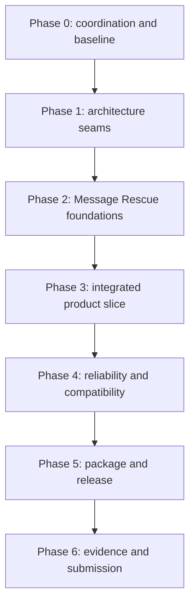

# BetterFingers — Accomplish Plan

> Execution plan for OpenAI Build Week and the first qualified BetterFingers alpha.
>
> **Submission deadline:** July 21, 2026 at 5:00 PM Pacific
>
> **Internal submission target:** July 21, 2026 at 3:00 PM Pacific
>
> **Baseline:** `main` at `ecbb3ce`
>
> **Primary category:** Apps for Your Life
>
> **Required OpenAI wording:** Codex and GPT-5.6

This is the active execution source of truth. `DESIGN.md` remains the long-horizon
product design, but it contains stale completion markers and must not be used as a task
queue until it is reconciled after the hackathon. Work that is not explicitly active in
this file belongs in `BACKBURNER.md`.

---

## 1. Outcome

Ship a judge-readable, demonstrably local-first BetterFingers alpha whose new Build Week
feature is **Message Rescue**:

> BetterFingers understands what the user said, how they said it, and the context they
> deliberately provided, then improves the message without erasing the user's voice.

The demo must show one uninterrupted path:

1. The user selects a small amount of relevant conversation context in another app.
2. BetterFingers captures that context explicitly and restores the clipboard.
3. The user speaks an unfinished or emotionally difficult reply.
4. Whisper returns text plus timing and confidence information.
5. BetterFingers derives transparent delivery signals such as pace, pauses, energy, and
   hesitation. It does not claim to diagnose the user's internal mental state.
6. The selected persona uses approved examples to preserve the user's voice.
7. BetterFingers identifies ambiguity or missing information and, when necessary, asks
   one useful clarification question.
8. The user compares a faithful result with clearer and softer/direct alternatives.
9. The user edits, listens, accepts, and places the result in the target application.
10. The same core loop is shown working through a qualified Windows or Linux package.

### Hackathon judging story

| Criterion | Evidence we will produce |
|---|---|
| Technological implementation | Codex/GPT-5.6 build log, structured STT result, speech-signal analysis, explicit context session, persona learning, tested pipeline boundaries |
| Design | One coherent runnable desktop flow, clear review controls, visible confidence, honest platform degradation, no proof-of-concept-only screen |
| Potential impact | Everyday communication and accessibility use cases demonstrated with a real message, not a synthetic feature tour |
| Quality of idea | Voice preservation plus delivery and explicit context, rather than generic grammar correction |

---

## 2. Verified starting point

The plan is based on the live repository, not only the older roadmap.

### What is already real

- Electron desktop shell with a Python FastAPI sidecar.
- Local faster-whisper STT, llama.cpp/Gemma rewriting, and Kokoro TTS.
- Review and status overlays, draft editing, rewrite actions, read-back, injection, and
  clipboard restoration.
- Persona schema v2, Persona Foundry, few-shot examples, output policy, safety mode,
  formatting rules, voice metadata, and active-preset dictation.
- Dictionary hotwords and post-ASR correction, formatting commands, macros, confidence,
  raw-audio recovery, SQLite FTS5 history, and privacy wipe.
- Job registry for dictation, model runtime leases, crash-safe send recovery, application
  paths, upload safety, logging redaction, and privacy-safe support reports.
- Windows NSIS and Linux AppImage workflows with hashes and build provenance.
- CycloneDX SBOM workflow, CodeQL workflow, and Dependabot configuration.
- Optional Windows Authenticode environment wiring using
  `WIN_CERTIFICATE_BASE64` and `WIN_CERTIFICATE_PASSWORD`.
- Wake engine, import path, local phrase trainer, settings UI, and visual QA. Real field
  recordings and FA/FR qualification remain incomplete and are not part of this build.
- Existing Claude collaboration MCP with registration, file claims, messaging, hooks,
  and a live viewer at `http://localhost:4517`.

### Baseline observations

- `server.py` is approximately 4,742 lines and mixes composition, shared state, routes,
  persistence, runtime lifecycle, dictation orchestration, privacy, diagnostics, and
  feature behavior.
- `app/src/renderer/main.js` is approximately 6,115 lines and mixes DOM discovery,
  feature state, rendering, event binding, polling, WebSocket behavior, and application
  bootstrap.
- `app/src/renderer/index.html` is also large, but splitting it is not a prerequisite for
  the Message Rescue build.
- `README.md` and `DESIGN.md` contain stale architecture and completion claims.
- In the current review environment, all 40 Node unit tests pass, the Electron production
  build passes, and all Python files compile. The full Python suite could not be run here
  because the checkout has no installed pytest environment. Re-establishing that baseline
  is Phase 0, not an assumed success.

### Documentation drift to correct before submission

- Do not say the renderer receives the backend bearer token; it now uses the main-process
  proxy and does not receive the token.
- Do not say release hashes, provenance, SBOM, CodeQL, or Dependabot are pending; the
  workflows exist. They still need a successful release run and evidence.
- Do not say the wake UI is absent. It exists, but real-audio qualification is pending.
- Do not use stale hard-coded test counts. Report the exact verified count from the final
  release commit or omit the number.
- Do not claim Windows, Linux, AMD, NVIDIA, X11, or Wayland support beyond the final tested
  capability matrix.
- Do not call the build 1.0. The intended release identity is `v0.1.0-alpha.1` unless the
  coordinator records a later decision.
- Do not write GPT-6 in the hackathon evidence. The official requirement is GPT-5.6.

---

## 3. Non-negotiable product and engineering rules

1. **Local-first remains true.** Message content, audio, context, and persona examples do
   not leave the device.
2. **Context is explicit.** The user selects or pastes context and can see, remove, and
   expire it. We do not scrape conversations or silently monitor text fields.
3. **Emotion is presented as an uncertain signal.** Show observable evidence and
   confidence. Never present frustration, sadness, excitement, happiness, or similar
   labels as a diagnosis.
4. **Voice learning is opt-in.** An approved edit becomes a persona example only after a
   clear user action. Examples are inspectable and removable.
5. **Facts survive rewriting.** Names, numbers, dates, negation, commitments, requests,
   and stated emotional intensity are preservation invariants.
6. **Existing REST and WebSocket contracts remain compatible during extraction.** New
   fields are additive until every caller and fixture is updated.
7. **No big-bang rewrite.** Extract one tested seam at a time. Keep compatibility wrappers
   while callers move.
8. **No framework migration.** The renderer stays vanilla JavaScript with ES modules.
9. **No hidden platform failure.** Unsupported injection degrades to an explicit
   copy-only result.
10. **No agent edits without a claim.** The shared collaboration workspace is mandatory.
11. **No worker manages Git.** Only the coordinator stages, commits, tags, rebases,
    switches branches, or publishes.
12. **Every user-visible state gets a QA scenario.** Follow
    `docs/QA_VISUAL_WALKBOOK.md`.
13. **Every content-bearing log path stays redacted.** Re-run the standing redaction gates
    whenever transcription, context, personas, prompts, diagnostics, or MCP behavior
    changes.

---

## 4. Scope boundary

### Must ship for the submission

- A readable hot-path architecture with the new work outside the monoliths.
- Structured transcription results that retain segment timing and confidence.
- Deterministic speech-delivery signal extraction with unit tests.
- Explicit, visible, one-use conversation context.
- Opt-in persona learning from approved raw-to-final examples.
- A Message Rescue assessment and three usable variants with safe fallbacks.
- Review UI showing context, delivery signals, clarification, and variants.
- A green automated baseline and documented manual hardware results.
- A Windows release candidate and a Linux AppImage release candidate.
- Honest signing status, hashes, provenance, and SBOM.
- Updated README, architecture documentation, tested capability matrix, GitHub Pages
  showcase, public demo, Build Week log, and Devpost fields.

### May ship only after the must-ship gate is green

- A narrowly scoped TTS clarity fix that directly affects the demo.
- Model-resource diagnostics UI if it can be added without touching active Message Rescue
  files.
- Additional persona editor controls that are required to inspect or remove learned
  examples.

### Explicitly out of the active build

- Wake-word expansion, command-mode expansion, or new always-listening behavior.
- Voice-cloning expansion or publication of new cloning artifacts.
- Meetings, brainstorming, Threads, Echo, semantic search, or agent/tool modes.
- Automatic 30-second text-box monitoring or automatic chat scraping.
- Broad visual redesign, framework migration, macOS support, or auto-update rollout.

See `BACKBURNER.md` for the preserved rationale and promotion gates.

---

## 5. Team topology

The intended maximum is four simultaneous coding sessions: two or three Claude Sonnet
sessions and one Codex GPT-5.6 session. The plan still works with fewer agents; lanes are
collapsed sequentially, never made broader.

| Session name | Suggested model | Primary lane | Must not own concurrently |
|---|---|---|---|
| `codex-56-contracts` | Codex GPT-5.6 Terra or the lowest-cost available GPT-5.6 coding tier | Contracts, pure modules, fixtures, narrow integration, documentation evidence | `server.py` or `main.js` while another session owns them |
| `sonnet-backend` | Claude Sonnet session | FastAPI extraction, dictation pipeline, stores, backend integration | Renderer hotspot files |
| `sonnet-renderer` | Claude Sonnet session | Renderer modules, Message Rescue UI, accessibility, QA states | Backend hotspot files |
| `sonnet-platform` | Optional third Claude Sonnet session | CI, locks, packaging, release scripts, hardware test records, Pages workflow | Product implementation files |
| `coordinator` | User plus reviewing Codex session | Scope, task dispatch, reviews, fixes, commits, build log, release, submission | Parallel feature implementation while reviewing an unaccepted handoff |

If only two Sonnet sessions are available, `sonnet-platform` becomes a sequential lane
after the renderer task in each wave. Do not give one model a larger cross-layer task to
compensate.

### Shared-checkout Git rule

All workers operate in the same checkout and on the coordinator-selected integration
branch. Workers must not run:

- `git add`, `git commit`, `git switch`, `git checkout`, `git rebase`, `git merge`,
  `git reset`, `git stash`, `git clean`, or tag/release commands;
- dependency formatters or generators that rewrite files outside their claim;
- shell redirection or scripts as a way to bypass a file claim.

The coordinator reviews each uncommitted handoff, applies fixes, runs the phase gate,
updates this file and the Build Week log, and commits exact paths. This avoids races over
the shared Git index and branch pointer, which file claims alone cannot protect.

---

## 6. Collaboration MCP protocol

### Existing Claude entry point

The repository already exposes the stdio server in `.mcp.json`:

```json
{
  "mcpServers": {
    "collab": {
      "command": "python3",
      "args": [".claude/collab-mcp/server.py"]
    }
  }
}
```

Claude Code also loads `.claude/skills/collab/SKILL.md` and hooks from
`.claude/settings.json`.

### Codex entry point

Codex officially supports stdio MCP servers in `config.toml`. Phase 0 must add and verify
a trusted project-scoped `.codex/config.toml` entry for this server plus Codex-compatible
hooks. Until that lands, the CLI fallback is:

```bash
codex mcp add collab -- python3 .claude/collab-mcp/server.py
codex mcp list
```

Then start Codex from the repository root and verify the `collab` server with `/mcp`.
The current review environment does not include the `codex` executable, so the first real
Codex terminal session must verify the command and record the result in the Build Week log.

### Cross-client hardening required in Phase 0

The existing implementation names `my_claude_pid()` and searches for a `claude` ancestor.
It also blocks Claude edit tools but does not yet parse Codex `apply_patch` requests. Before
parallel Codex work:

- introduce a client-neutral session identity, preferably an explicit environment session
  ID with a safe process-ancestor fallback for both `claude` and `codex`;
- configure the Codex project MCP server;
- add Codex project instructions in `AGENTS.md`;
- add Codex hooks for session status, inbox delivery, and `apply_patch` claim checks;
- make the hook reject an `apply_patch` touching any path claimed by another session;
- document that shell commands may not write source files;
- extend the collaboration E2E test to simulate one Claude client and one Codex client;
- verify both clients see the same sessions, claims, and messages.

### Mandatory lifecycle for every worker task

1. Call `collab_register` with the assigned session name and exact task ID.
2. Call `collab_status` and `collab_inbox`.
3. Call `collab_claim` for every production file, test file, generated artifact, and shared
   pseudo-resource the task will touch.
4. Post an `info` message: `START <task-id> — outcome; claimed paths; planned tests`.
5. Work only inside the claim.
6. Check `collab_inbox` after contract changes and before verification.
7. Run targeted tests. Claim `__full-test-suite__`, `__llama-server__`, `__port-8000__`,
   or another shared resource before using it.
8. Post a `handoff` containing the exact fields below.
9. Call `collab_release` immediately.
10. Stop. Do not start a dependent task until the coordinator posts `ACCEPTED`.

### Handoff format

```text
HANDOFF <task-id>
Outcome: <one sentence>
Changed: <repo-relative files>
Contracts: <API/schema/event/import changes or "none">
Tests: <commands and exact result>
Manual checks: <performed or not performed>
Risks: <known limitations, fallbacks, follow-ups>
Diff ready: yes; no files staged or committed
```

Use `urgent` only for an active contract break, shared-file hazard, privacy/security bug,
or merge-blocking discovery. Everything else is `question`, `handoff`, or `info`.

---

## 7. Small-task contract

Large phases describe outcomes. Worker tasks stay deliberately small so a cost-conscious
GPT-5.6 model or a focused Sonnet session can execute them reliably.

### Normal task limits

- 30–120 minutes of implementation work.
- One behavior change or one extraction.
- One owner.
- One to three production files, plus directly related tests and fixtures.
- One predeclared interface contract.
- One targeted verification command that normally finishes in under five minutes.
- No opportunistic cleanup outside the task.

An extraction may exceed three files only when the move is mechanical and the coordinator
has approved the exact path list before the claim.

### Worker prompt template

Use this template verbatim when dispatching work, especially to GPT-5.6 Terra:

```text
ROLE
You are <session-name>, working in the shared BetterFingers checkout.

TASK
<task-id>: <single outcome>

READ FIRST
<specific docs, functions, tests, and contracts>

CLAIM
<exact repo-relative paths and pseudo-resources>

DO NOT TOUCH
<hotspot files and neighboring concerns explicitly excluded>

CONTRACT
<inputs, outputs, schema, events, compatibility requirements, privacy rules>

STEPS
1. <bounded step>
2. <bounded step>
3. <bounded step>

VERIFY
<targeted commands and expected result>

HANDOFF
Use the repository HANDOFF format, release claims, and stop.

STOP CONDITIONS
Stop and post a question if a contract is missing, a claimed path conflicts,
an unexpected migration is required, or the task would expand beyond scope.
```

### Definition of done for every accepted task

- The behavior has direct tests, not only mocks of itself.
- Existing public contracts either remain stable or have an approved additive change.
- New user-visible states have deterministic visual QA scenarios.
- Errors are useful without exposing dictated text, context, prompts, or persona examples.
- Windows and Linux paths are considered; unsupported paths fail honestly.
- No content is silently discarded; raw audio/recovery behavior remains intact.
- The handoff reports exact tests and unperformed manual checks.
- The coordinator has reviewed the diff, run the appropriate gate, fixed defects, updated
  the Build Week log, committed exact files, and posted `ACCEPTED <task-id> <commit>`.

---

## 8. Dependency map



Within a phase, tasks in the same wave may run in parallel only when their claims do not
overlap. The coordinator opens the next wave after all prerequisites are accepted.

---

## 9. Phase 0 — coordination, scope, and reproducible baseline

**Goal:** prove that four sessions can work safely and establish a trustworthy test/build
baseline before feature changes.

### Wave 0A — collaboration and environment

| ID | Owner | Outcome | Primary claims | Verification |
|---|---|---|---|---|
| C0.1 | `sonnet-platform` | Make the collaboration MCP client-neutral and Codex-compatible | `.claude/collab-mcp/collab_lib.py`, `.claude/collab-mcp/hooks.py`, `.claude/collab-mcp/server.py`, `.claude/collab-mcp/test_collab.py`, `.codex/config.toml`, `.codex/hooks.json`, `AGENTS.md` | Collaboration E2E passes with simulated Claude and Codex identities; real Claude and Codex sessions exchange one message and reject one conflicting claim |
| C0.2 | `codex-56-contracts` | Create `docs/BUILD_WEEK_LOG.md` with pre-existing versus Build Week scope, baseline commit, environment, session IDs, and evidence template | `docs/BUILD_WEEK_LOG.md` | Markdown links resolve; baseline and official GPT-5.6 wording are correct |
| C0.3 | `sonnet-backend` | Recreate the supported Python environment from committed inputs and run the cheap suite | no committed source unless a setup defect is found; claim `__python-env__` | Environment creation recorded; cheap pytest result exact |
| C0.4 | `sonnet-renderer` | Reconfirm Node install, unit tests, Electron build, and model-free smoke prerequisites | no source unless a baseline defect is found; claim `__electron-build__` | `npm run test:unit`; `npm run build`; smoke readiness recorded |

### Wave 0B — full baseline and scope freeze

| ID | Owner | Outcome | Primary claims | Verification |
|---|---|---|---|---|
| C0.5 | `sonnet-platform` | Run the full Python suite once without competing model-heavy work | `__full-test-suite__` | Exact pass/fail/skip count and duration recorded; every failure classified |
| C0.6 | coordinator | Create the single integration branch and freeze the task roster | Git/branch only | Working tree clean; every active task has an owner and non-overlapping claims |
| C0.7 | coordinator | Capture pre-change screenshots/video and current package/README claims | evidence directory selected by coordinator | Before-state evidence linked from Build Week log |

### Phase 0 gate

- [ ] One Claude and one Codex session can register, claim, message, receive an urgent
  interruption, and release claims in the same room.
- [ ] Workers understand coordinator-only Git.
- [ ] Python cheap and full baselines are recorded.
- [ ] Node unit tests and Electron build are green.
- [ ] Any existing red CI failure is either fixed or explicitly assigned before Phase 1.
- [ ] Pre-Build-Week functionality is clearly separated from new work.

---

## 10. Phase 1 — dismantle the hot-path monoliths safely

**Goal:** make the code judges and new agents must understand first live in named modules
with narrow contracts. Do not attempt to move every route before the deadline.

### Target backend shape

```text
backend/
  api/routes/          thin FastAPI adapters
  domain/              dataclasses and stable result contracts
  services/            dictation and Message Rescue behavior
  stores/              draft/context/persona persistence boundaries
  runtime/             dependency container and coordinators
server.py              composition, compatibility exports, startup/shutdown
```

### Target renderer shape

```text
app/src/renderer/
  api/backend.js       backend transport only
  features/drafts.js
  features/personas.js
  features/messageRescue.js
  features/runtime.js
  state/appState.js
  main.js              bootstrap and feature composition
```

### Wave 1A — contracts and independent extraction

| ID | Owner | Outcome | Primary claims | Depends on | Verification |
|---|---|---|---|---|---|
| A1.1 | `codex-56-contracts` | Scaffold backend packages and define additive `TranscriptionResult`, `TimedSegment`, `SpeechSignals`, `ContextEnvelope`, and `MessageRescueResult` contracts without wiring callers | new `backend/**` domain files and new contract tests only | Phase 0 | Pure tests; JSON serialization round trips; no server import required |
| A1.2 | `sonnet-backend` | Extract persona endpoints into a thin router/service while preserving current route behavior and server compatibility exports | `server.py`, new persona route/service files, persona route tests | Phase 0 | Existing persona and Foundry route tests plus OpenAPI path comparison |
| A1.3 | `sonnet-renderer` | Extract draft state/rendering/event helpers from `main.js` without changing UI behavior | `app/src/renderer/main.js`, new `features/drafts.js`, directly related unit tests | Phase 0 | Unit tests, build, model-free draft QA scenario |
| A1.4 | `sonnet-platform` | Add an architecture import/smoke gate that detects accidental circular imports and verifies the packaged backend includes the new package | packaging script or focused test files only | A1.1 scaffold contract agreed | Import test and backend build dry-run or PyInstaller analysis |

### Wave 1B — stores, pipeline, and renderer composition

| ID | Owner | Outcome | Primary claims | Depends on | Verification |
|---|---|---|---|---|---|
| A1.5 | `sonnet-backend` | Extract draft persistence and lookup behind a `DraftStore` while retaining compatibility wrappers used by tests | `server.py`, new store files, draft persistence/send-recovery tests | A1.2 accepted | Persistence, crash recovery, wipe/send race, and history mirror tests |
| A1.6 | `codex-56-contracts` | Create a dependency-injected dictation pipeline service shell with named stages and no FastAPI imports | new service/runtime files and pure tests | A1.1 accepted | Stage-order, cancellation, error, and recovery-result tests with fakes |
| A1.7 | `sonnet-renderer` | Extract persona state/editor helpers and runtime/bootstrap helpers from `main.js` | `main.js`, new `features/personas.js`, `features/runtime.js`, unit tests | A1.3 accepted | Unit tests, build, persona reopen/preservation QA |
| A1.8 | `sonnet-platform` | Add file-size/import-budget reporting as information, not a brittle line-count gate | new tool/test and Build Week log entry | A1.2–A1.7 | Report identifies composition roots and module graph without failing on comments |

### Wave 1C — move the live hot path

| ID | Owner | Outcome | Primary claims | Depends on | Verification |
|---|---|---|---|---|---|
| A1.9 | `sonnet-backend` | Move `process_recording_result` orchestration behind the new service while preserving `server.process_recording_result` as a compatibility wrapper | `server.py`, dictation service/runtime files, pipeline tests | A1.5 and A1.6 accepted | Single-flight, cancellation, no-audio, metrics, recovery, preset, command, and draft route tests |
| A1.10 | `sonnet-renderer` | Reduce `main.js` to composition for the extracted feature areas and document feature initialization order | renderer feature files, `main.js`, renderer tests | A1.7 accepted | Unit tests, production build, baseline visual QA |
| A1.11 | coordinator | Review public API compatibility and update the architecture map in the Build Week log | docs only after code accepted | A1.9 and A1.10 | Full phase gate |

### Phase 1 gate

- [ ] `server.py` is still runnable but the live dictation behavior is owned by a service.
- [ ] Persona routes and draft persistence have named owners outside `server.py`.
- [ ] `main.js` composes extracted draft, persona, and runtime modules.
- [ ] Existing route paths and WebSocket statuses remain compatible.
- [ ] Compatibility re-exports are documented and have removal notes for after the
  hackathon.
- [ ] Python full suite, Node unit tests, Electron build, and model-free smoke are green.
- [ ] No raw text appears in new logs or diagnostics.

---

## 11. Phase 2 — Message Rescue foundations

**Goal:** build each new capability as a pure or narrowly integrated component before
assembling the UI.

### Frozen data contracts

The coordinator freezes these additive shapes after A1.1. Field names may not change
without an `urgent` collaboration message and an accepted contract amendment.

```text
TranscriptionResult
  text
  segments[]: start_s, end_s, text, avg_logprob, no_speech_prob
  confidence
  audio_duration_s

SpeechSignals
  words_per_minute
  speaking_ratio
  pause_count
  pause_ratio
  mean_pause_s
  longest_pause_s
  filler_count
  self_correction_count
  energy_mean
  energy_variation
  delivery_axes: arousal, urgency, hesitation
  evidence[]
  confidence

ContextEnvelope
  id
  text
  source: selection | clipboard_fallback | manual
  captured_at
  expires_at
  use_count
  max_uses
  visible_preview

MessageRescueResult
  assessment: intent, ambiguity_risk, missing_details[], clarification_question
  delivery: labels[], confidence, evidence[]
  variants: faithful, clearer, alternate
  preservation_checks[]
  warnings[]
```

### Wave 2A — pure components in parallel

| ID | Owner | Outcome | Primary claims | Verification |
|---|---|---|---|---|
| F2.1 | `codex-56-contracts` | Implement deterministic speech-signal calculation from timed segments and audio windows | speech-signal module and tests | Quiet/fast/slow/paused/empty/noisy fixtures; bounded 0–1 axes; no emotion diagnosis |
| F2.2 | `sonnet-backend` | Make the transcriber produce the structured result while preserving legacy tuple/text callers | `transcriber.py`, transcription adapter/domain files, transcriber tests | Legacy callers unchanged; segment timing retained; hallucination and confidence tests green |
| F2.3 | `sonnet-renderer` | Build pure view-model formatting for context, signal evidence, clarification, and variants | new `features/messageRescue.js` and unit tests only | Empty/partial/error/low-confidence/complete payload cases |
| F2.4 | `sonnet-platform` | Create deterministic, synthetic speech-signal fixtures and a privacy-safe test-data policy | fixture/test-data files only | No real personal speech; fixture provenance documented; tests deterministic |

### Wave 2B — context, learning, and rescue generation

| ID | Owner | Outcome | Primary claims | Depends on | Verification |
|---|---|---|---|---|---|
| F2.5 | `sonnet-backend` | Implement an in-memory, one-use `ContextSession` using the existing safe selection capture, with manual fallback and explicit expiry | context service, selection adapter, tests; no renderer | A1.9 | Clipboard restoration, expiry, max-use, clear, empty, and Wayland fallback tests |
| F2.6 | `codex-56-contracts` | Implement opt-in persona example learning using the existing few-shot schema: cap, dedupe, inspect, delete, and atomic persistence | persona learning service and tests | A1.2 | No silent learning; duplicate and overflow behavior; migration compatibility |
| F2.7 | `sonnet-backend` | Implement Message Rescue prompt construction and robust result parsing with deterministic safe fallbacks | rescue service and tests; no route/UI | F2.1 and contracts | Valid JSON, malformed output, empty output, timeout, preservation violations, clarification/no-clarification cases |
| F2.8 | `sonnet-renderer` | Add accessible static Message Rescue panel markup/styles behind an inactive feature flag | `index.html`, CSS, feature module, visual scenario | F2.3 | Keyboard/focus/contrast/reduced-motion checks; screenshot QA |

### Prompt and rewrite invariants

The local LLM receives only the current raw transcript, explicit context, speech-signal
summary, selected persona, and approved examples. The system instruction must require:

- no invented facts or commitments;
- names, numbers, dates, locations, URLs, negation, and modality preserved;
- emotional intensity preserved unless the user requests a tone change;
- context used for interpretation but not repeated into the output;
- one clarification question only when the missing detail materially changes the message;
- output-only structured data with a strict size ceiling;
- fallback to the faithful/raw result on parse or preservation failure.

### Phase 2 gate

- [ ] Each foundation is independently unit tested.
- [ ] No new module requires FastAPI, Electron, a real model, or real audio to run its core
  tests.
- [ ] Context is visible, expiring, and user-controlled.
- [ ] Persona learning is opt-in and reversible.
- [ ] Delivery signals cite observable evidence and confidence.
- [ ] The rescue parser cannot turn malformed model output into an empty message.

---

## 12. Phase 3 — integrated Message Rescue product slice

**Goal:** connect the foundations into the real dictate → review → place loop without
creating a second application mode.

### Wave 3A — backend integration

| ID | Owner | Outcome | Primary claims | Depends on | Verification |
|---|---|---|---|---|---|
| I3.1 | `sonnet-backend` | Feed `TranscriptionResult` and `SpeechSignals` through the dictation pipeline and store them additively on drafts | dictation service, draft domain/store, related tests | F2.1, F2.2 | Old draft JSON loads; new draft survives restart; confidence/send policy unchanged |
| I3.2 | `codex-56-contracts` | Add thin context capture/status/clear routes and Message Rescue request/result routes | new routers, proxy allowlist if required, route tests | F2.5, F2.7 | Auth/proxy allowlist, size limits, expiry, cancellation, response schema |
| I3.3 | `sonnet-backend` | Add explicit persona learn/list/delete-example routes through the persona service | persona router/service tests | F2.6 | Consent flag required; capped examples; atomic store; privacy report lists storage |
| I3.4 | `sonnet-platform` | Extend support report and privacy assertions for new context/example data without including content | diagnostics/privacy tests only | I3.1–I3.3 contracts | Reports describe counts/paths/retention, never text |

### Wave 3B — renderer integration

| ID | Owner | Outcome | Primary claims | Depends on | Verification |
|---|---|---|---|---|---|
| I3.5 | `sonnet-renderer` | Add backend client functions and bind the Message Rescue panel to real draft/context payloads | `api/backend.js`, Message Rescue module, `main.js` composition | I3.2 | Unit tests, proxy route tests, production build |
| I3.6 | `sonnet-renderer` | Implement context capture/preview/clear and one-use status | Message Rescue UI files and QA scenarios | I3.5 | Selection success, clipboard fallback, clear, expiry, unsupported capture states |
| I3.7 | `sonnet-renderer` | Render delivery evidence, clarification, and three variants; selecting a variant updates the existing draft review path | Message Rescue UI files and QA scenarios | I3.5 | Low-confidence, no-clarification, clarification, fallback, and variant-selection states |
| I3.8 | `sonnet-renderer` | Add `Teach this persona from my edit`, example list, and delete controls with explicit consent language | persona/draft feature modules and QA | I3.3 | No learning without click; duplicate feedback; delete; reload persistence |

### Wave 3C — end-to-end behavior

| ID | Owner | Outcome | Primary claims | Depends on | Verification |
|---|---|---|---|---|---|
| I3.9 | `codex-56-contracts` | Add model-free end-to-end Message Rescue scenarios using contract-faithful stubs and negative controls | Playwright/QA scenarios and fixtures | I3.5–I3.8 | Complete flow; malformed rescue result; stale context; privacy lie caught |
| I3.10 | `sonnet-backend` | Add live-model integration test harness that can skip cleanly when the model is unavailable | integration test/tool files | I3.1–I3.4 | At least one real local run recorded; skip is explicit, never reported as pass |
| I3.11 | coordinator | Run a real microphone demo, review every output for preservation, and record defects as small repair tasks | hardware/model pseudo-claims | all Phase 3 work | Real video-ready path or explicit blocker list |

### Phase 3 gate

- [ ] One real selected-context + spoken-message flow completes locally.
- [ ] Raw transcript and final variants are never empty when speech was usable.
- [ ] Context is consumed once and does not leak into the final message.
- [ ] A learned persona example changes a later rewrite in a demonstrably voice-preserving
  direction.
- [ ] Names, numbers, dates, negation, and commitments survive the demo corpus.
- [ ] Every visible state has a deterministic QA scenario.
- [ ] Full automated phase gate is green.

---

## 13. Phase 4 — reliability and Windows/Linux qualification

**Goal:** replace “works everywhere” with tested evidence and make the core loop boringly
dependable.

### Automated repair wave

| ID | Owner | Outcome | Primary claims | Verification |
|---|---|---|---|---|
| R4.1 | `sonnet-backend` | Resolve all Python suite failures on supported Python/OS matrix without weakening assertions | failing backend/test files only | Linux 3.12/3.13 and Windows 3.13 CI green; macOS remains informational unless touched |
| R4.2 | `sonnet-renderer` | Resolve Node, build, smoke, and visual QA regressions | failing renderer/test files only | Unit, build, smoke, QA report green |
| R4.3 | `sonnet-platform` | Make lock freshness, installer, AppImage, SBOM, CodeQL, and release jobs green at the release candidate commit | workflow/lock/build files only | Every required workflow green or an explicit signed-off exception |
| R4.4 | `codex-56-contracts` | Audit new code for cancellation, data loss, logging leaks, store migration, context expiry, and cross-platform fallbacks | tests and narrow fixes after claims | New adversarial tests plus existing privacy/redaction gates |

### Real-hardware qualification matrix

Record hardware, OS build, session type, model versions, artifact hash, and exact result.
An unperformed check is `UNTESTED`, never `PASS`.

| Gate | Windows | Linux X11 | Linux Wayland |
|---|---|---|---|
| Clean install/launch | Required | Required | Required if hardware available |
| CPU-only STT/LLM fallback | Required | Required | Same as Linux artifact |
| NVIDIA acceleration | Required only when hardware exists | Optional evidence | Optional evidence |
| AMD/Vulkan acceleration | Claim only if physically tested | Claim only if physically tested | Claim only if physically tested |
| Microphone select/unplug/replug | Required | Required | Required if tested |
| Sleep/resume | Required | Required | Required if tested |
| 100 consecutive dictations | Required on at least one primary platform | Required on at least one primary platform | Not required |
| 50 restart/startup recoveries | Required on release platform | Required on release platform | Not required |
| 5/15/30/60 minute recordings | Required on one provisioned machine | May share evidence | May share evidence |
| Model crash/restart | Required | Required | Required if tested |
| Clipboard restoration | Required | Required | Copy-only behavior required |
| Injection matrix | Notepad, browser, VS Code, Discord plus available targets | Terminal, browser, VS Code plus available targets | Copy-only degradation and honest warning |
| Message Rescue demo | Required on one platform | Required on one platform | Optional |
| Privacy wipe after use | Required | Required | Required if tested |

### Reliability benchmark procedure

1. Claim `__full-test-suite__`, `__port-8000__`, `__llama-server__`, and the active audio
   device pseudo-claim as appropriate.
2. Run `tools/reliability_benchmark.py` against the packaged or release-candidate sidecar.
3. Perform every manual check recorded in `reliability_benchmark.MANUAL_CHECKS`.
4. Save the JSON/Markdown report under the coordinator-approved evidence path.
5. Copy only privacy-safe summaries into the repository and public materials.
6. Open one small repair task per failure. Do not allow a worker to “fix the benchmark” by
   weakening the gate.

### Phase 4 gate

- [ ] Supported CI is green.
- [ ] The reliability report distinguishes PASS, FAIL, and UNTESTED honestly.
- [ ] The support report is sufficient for a tester to report platform/runtime state.
- [ ] Windows has a demonstrated non-NVIDIA CPU path.
- [ ] Linux AppImage launches and serves its bundled backend.
- [ ] Wayland behavior is labeled limited/copy-only where appropriate.
- [ ] No claim in README, Pages, video, or Devpost exceeds the matrix.

---

## 14. Phase 5 — package, sign, and publish the alpha candidate

**Goal:** produce traceable release artifacts without pretending an unsigned build is
signed.

| ID | Owner | Outcome | Primary claims | Verification |
|---|---|---|---|---|
| P5.1 | `sonnet-platform` | Synchronize `0.1.0-alpha.1` identity across backend, Electron, filenames, diagnostics, release notes, and tag plan | version/build/docs files only | Runtime/version endpoint, installer metadata, filenames, and release draft agree |
| P5.2 | `sonnet-platform` | Run Windows installer build, install/upgrade/uninstall smoke, checksum, attestation, and signing when secrets exist | release workflow and evidence | Signature inspected with platform tools; unsigned status explicit if no certificate |
| P5.3 | `sonnet-platform` | Run Linux AppImage build/launch smoke, checksum, attestation, and SBOM | release workflow and evidence | Artifact launches; bundled backend responds; hash and SBOM attached |
| P5.4 | `codex-56-contracts` | Review release manifests, licenses, model/runtime provenance, and downloadable URLs | license/manifests/docs, narrow fixes | Every managed asset has source, revision, license, hash, and compatibility facts |
| P5.5 | coordinator | Create the GitHub prerelease and Source Arcanum release link after artifacts pass | external release actions | Published URLs resolve; hashes match downloaded files |

### Signing decision

- If `WIN_CERTIFICATE_BASE64` and `WIN_CERTIFICATE_PASSWORD` are configured, the Windows
  installer must be signed and the signature must be verified after download.
- If no certificate exists, the artifact may still be used for the hackathon, but every
  page must call it an **unsigned alpha**. Acquiring a certificate is an external owner
  dependency, not an implementation task that an agent can fake.
- Linux release evidence consists of the artifact hash, GitHub provenance attestation,
  SBOM, and any separately configured signature. Do not imply Authenticode applies to the
  AppImage.

### Phase 5 gate

- [ ] Windows `.exe`, `.sha256`, signature status, and provenance are recorded.
- [ ] Linux `.AppImage`, `.sha256`, provenance, and SBOM are recorded.
- [ ] A downloaded artifact is re-hashed and launched, not merely observed in CI.
- [ ] Release notes identify known limitations and the exact tested hardware matrix.
- [ ] Source Arcanum points to the release; the BetterFingers repo remains the workshop.

---

## 15. Phase 6 — README, GitHub Pages, demo, and Devpost

**Goal:** let a judge understand, run, and evaluate the project in minutes.

### Evidence and publication wave

These tasks may begin in parallel after the Phase 4 capability matrix is frozen. Any
placeholder fact must block publication until it is replaced with evidence from the
release candidate.

| ID | Owner | Outcome | Primary claims | Depends on | Verification |
|---|---|---|---|---|---|
| S6.1 | `codex-56-contracts` | Rewrite the README and architecture/module guide from verified release facts | `README.md`, architecture docs, `docs/BUILD_WEEK_LOG.md` by coordinator-approved turn | Phase 4 and P5.1 | Every command is rerun; local links resolve; capability and Build Week claims trace to evidence |
| S6.2 | `sonnet-platform` | Build and deploy the focused GitHub Pages showcase | `site/**`, Pages workflow/config only | Phase 4 matrix and final UI screenshots | Local static-site check; mobile/desktop QA; deployed URL checked anonymously |
| S6.3 | `sonnet-renderer` | Prepare deterministic demo data/states, capture the short preview asset, and verify the real demo route | QA fixtures/scenarios and coordinator-approved media paths; no product behavior changes | Phase 3 and Phase 4 | Demo rehearsal succeeds twice from a clean launch; preview contains no private data |
| S6.4 | `sonnet-backend` | Produce privacy-safe architecture, storage, and model/runtime evidence for public copy | evidence/docs paths only; no production changes without a repair task | Phase 4 and P5.4 | Public facts match support report, licenses, redaction rules, and artifact manifests |
| S6.5 | `codex-56-contracts` | Draft Devpost field copy and run the repository/release/site/video link audit | submission draft and link-audit evidence only | S6.1–S6.4 drafts | No planned feature is written as shipped; all technology names and URLs match the release |
| S6.6 | coordinator | Record and publish the author-narrated video, run `/feedback`, complete Devpost, and obtain final authorization | external publishing actions and final evidence | P5 release plus accepted S6.1–S6.5 | Incognito link check; field-by-field review; explicit user approval before submission |

### README work packet

The final README must contain, in this order:

1. Product sentence and 15-second GIF/video preview.
2. What the judge should try in under three minutes.
3. Message Rescue walkthrough.
4. What existed before Build Week versus what was built during Build Week.
5. How Codex and GPT-5.6 were used, with links to the Build Week log and representative
   commits.
6. Windows and Linux install instructions.
7. Tested capability/hardware matrix.
8. Current architecture map and module guide.
9. Privacy and local-first data behavior.
10. Development and test commands.
11. Known limitations and unsigned/signed status.
12. License, security reporting, Source Arcanum, and contribution links.

### GitHub Pages site

Build a small static site in `site/` and deploy it through GitHub Pages at the expected
project URL:

`https://roygslade.github.io/BetterFingers/`

The site is the hackathon showcase, not a second documentation system. It should contain:

- hero and short demo;
- before/after message example;
- context + speech signals + persona explanation;
- local-first architecture and privacy statement;
- accessibility use cases without medical claims;
- Windows/Linux capability matrix;
- download, repository, Devpost, and Source Arcanum links;
- known limitations;
- Open Graph image and basic metadata.

Do not create a third repository unless GitHub Pages cannot be deployed from this repo.

### Public demo under three minutes

| Time | Content |
|---:|---|
| 0:00–0:12 | The problem: technically correct messages can still feel wrong |
| 0:12–0:35 | Select conversation context and speak a rough reply |
| 0:35–1:00 | Show transcript timing, delivery evidence, and ambiguity/clarification |
| 1:00–1:25 | Compare generic cleanup with voice-preserving persona variants |
| 1:25–1:45 | Edit, teach the persona, listen, and place the message in another app |
| 1:45–2:10 | Show local architecture, privacy controls, and recovery behavior |
| 2:10–2:35 | Show Windows/Linux artifacts and honest capability matrix |
| 2:35–2:50 | Explain Codex/GPT-5.6 contribution and point to the Build Week log |
| 2:50–3:00 | BetterFingers: Your voice. The right message. |

Requirements:

- public YouTube URL;
- less than three minutes;
- voiceover by the project author;
- real app footage, not only slides;
- explain what was built and how Codex/GPT-5.6 contributed;
- do not submit generated narration unchanged; rewrite it in the author's own voice.

### Devpost completion checklist

- [ ] Submitter type completed.
- [ ] Country completed.
- [ ] Category set to Apps for Your Life unless the coordinator records a change.
- [ ] Public code repository URL set.
- [ ] README explicitly highlights Codex and GPT-5.6.
- [ ] `/feedback` run in the primary Build Week Codex thread and session ID saved.
- [ ] Optional project URL set to the verified GitHub Pages URL.
- [ ] Public video attached and verified in an incognito browser.
- [ ] Technology tags match the final code and models, not planned features.
- [ ] Description distinguishes shipped behavior from future work.
- [ ] Thumbnail attached.
- [ ] All links tested.
- [ ] Final submission performed only after explicit user authorization.

### Phase 6 gate

- [ ] A stranger can understand the product and start the supported path from README.
- [ ] Pages, repository, release, video, and Devpost links all resolve publicly.
- [ ] The description remains in the author's voice.
- [ ] Build Week work and pre-existing work are clearly distinguished.
- [ ] The video and README use GPT-5.6, not GPT-6.
- [ ] Submission occurs by the 3:00 PM Pacific internal target.

---

## 16. Verification commands

Use the smallest relevant command during a worker task. Run the complete gate only at a
coordinator checkpoint and claim shared resources first.

### Fast backend iteration

```bash
python3 -m pytest -q <targeted-test-files>
python3 -m pytest -q -k "not transcriber and not tts_engine"
python3 -m py_compile <touched-python-files>
```

### Full backend gate

```bash
python3 -m pytest -q tests
```

### Renderer and Electron

```bash
cd app
npm run test:unit
npm run build
npx playwright test tests/electron-smoke.spec.js
npm run qa:screens
```

### Release and hardware tools

```bash
python3 tools/reliability_benchmark.py --help
python3 tools/injection_probe.py --help
python3 tools/performance_benchmark.py --help
```

Use the platform-specific installer and AppImage workflow for actual artifacts. Do not
substitute a renderer build for a packaged-app qualification.

---

## 17. Coordinator review loop

After every worker handoff, the coordinator performs this loop before accepting it:

1. Read the collaboration handoff and confirm all claims were released.
2. Inspect `git status` and the exact diff. Reject unrelated files immediately.
3. Review correctness, architecture boundary, data lifecycle, cancellation, error paths,
   Windows/Linux behavior, accessibility, privacy, and test quality.
4. Run the worker's targeted tests independently.
5. Add adversarial tests for assumptions the worker did not cover.
6. Apply or assign small repair tasks; do not hide defects in a follow-up paragraph.
7. Run the phase-appropriate integration gate.
8. Update `docs/BUILD_WEEK_LOG.md` with model/session, task, user decisions, tests,
   screenshots, benchmark evidence, and material Codex/GPT-5.6 contribution.
9. Update the checkbox/task status in this file.
10. Stage exact paths and create one intentional commit.
11. Post `ACCEPTED <task-id> <commit-sha>` and announce any contract changes.
12. Open the next dependent task only after the accepted commit exists.

### Review severity

- **Blocker:** data loss, privacy leak, unsafe injection, broken package, false support
  claim, destructive action without confirmation, or failure of the core demo.
- **High:** race, cancellation failure, stale-store corruption, contract break, missing
  fallback, cross-platform crash, or untestable architecture.
- **Medium:** confusing UX, incomplete error state, weak test, maintainability regression,
  or documentation mismatch.
- **Low:** naming, small duplication, minor visual polish, or non-blocking copy issue.

Blockers and highs must be fixed before the task is accepted. Mediums need a recorded
decision. Lows may move to `BACKBURNER.md` only when they do not affect the demo or claims.

---

## 18. Calendar

### July 17

- Phase 0 complete.
- Phase 1 Wave 1A started.
- Pre-change evidence and Build Week log created.

### July 18

- Phase 1 complete by midday.
- Phase 2 foundations complete by end of day.
- First pure Message Rescue result generated from fixtures.

### July 19

- Phase 3 backend and renderer integration.
- First real microphone/context/persona demo.
- Repair tasks from the first coordinator review.

### July 20

- Feature freeze.
- Phase 4 reliability and platform qualification.
- Phase 5 release candidate artifacts.
- README and Pages content drafted from verified facts.

### July 21

- Morning: final artifact download test, video recording, README/Pages publish, `/feedback`.
- Noon: Devpost field-by-field review.
- 3:00 PM Pacific: internal submission deadline.
- 5:00 PM Pacific: official deadline; do not plan work inside the final two-hour buffer.

---

## 19. Final release and submission gate

The coordinator may recommend submission only when every statement below is true:

- [ ] The core Message Rescue demo works on a real microphone and local model.
- [ ] The active architecture is understandable from README and module names.
- [ ] All required automated gates are green at the release commit.
- [ ] Manual hardware checks are recorded as PASS, FAIL, or UNTESTED.
- [ ] Windows and Linux artifacts are downloadable and launchable.
- [ ] Signing status is verified and described honestly.
- [ ] Hashes, provenance, SBOM, licenses, and release identity are consistent.
- [ ] Privacy, context expiry, and persona-example deletion work.
- [ ] No output or diagnostic path leaks message content by default.
- [ ] README, Pages, demo, repository, release, and Devpost agree about shipped features.
- [ ] Codex/GPT-5.6 evidence and `/feedback` session ID are present.
- [ ] The public description is in the author's own voice.
- [ ] The user has explicitly authorized the final Devpost submission.

The goal is not to claim that BetterFingers is flawless. The goal is to show a coherent,
useful, trustworthy product with unusually strong evidence for what works, where it works,
and what was genuinely built during OpenAI Build Week.
