# BetterFingers QA Walkbook

Generated by `node app/tests/qa/run.mjs`. 21/21 scenarios passed. Every screenshot below was taken against the REAL Electron app driven by a deterministic stub backend -- not a mockup. Determinism rules: fixed 1280x800 viewport, --force-device-scale-factor=1, TZ=UTC, animations disabled, dynamic regions masked (see harness.mjs DEFAULT_MASK_SELECTORS).

## baseline

### dashboard-loads — ✅ PASS

Fresh launch against a cold-boot stub backend: the dashboard tab is active by default, shows the "BetterFingers" hero header, and the backend status badge reflects the stub as ready (the app never spawned a real Python backend -- it detected the stub as "external" and used it directly).

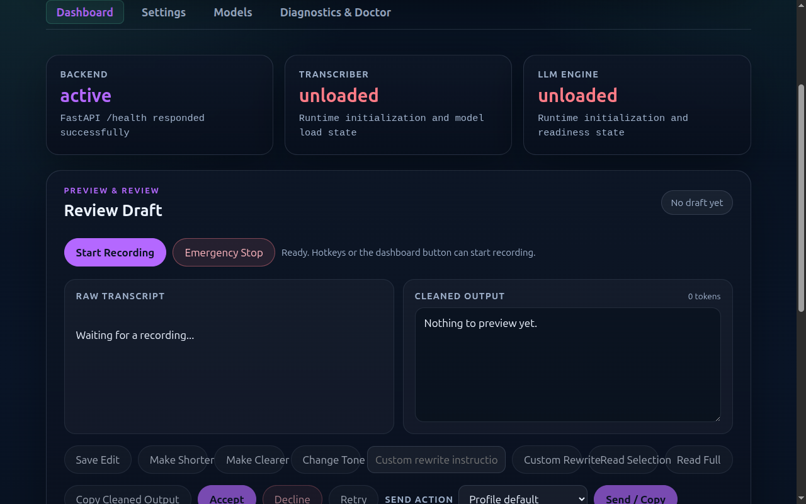

### settings-general-renders — ✅ PASS

Settings tab opens with the General category active by default (every other category hidden). Confirms the settings-nav/settings-section wiring survives whatever the other tier3 sessions changed in main.js.

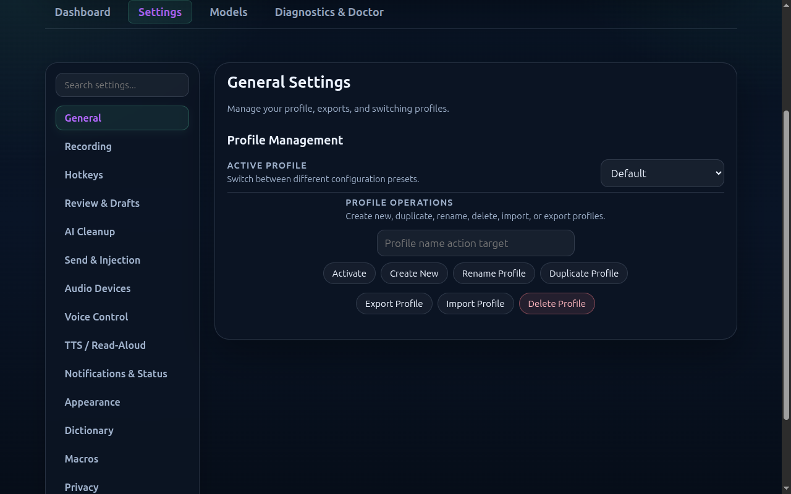

### settings-recording-renders — ✅ PASS

Clicking the Recording nav button switches the active section and hides General -- the same interaction electron-smoke.spec.js exercises, re-verified here against a fully deterministic backend so a failure here means a real renderer regression, not stub/model flakiness.

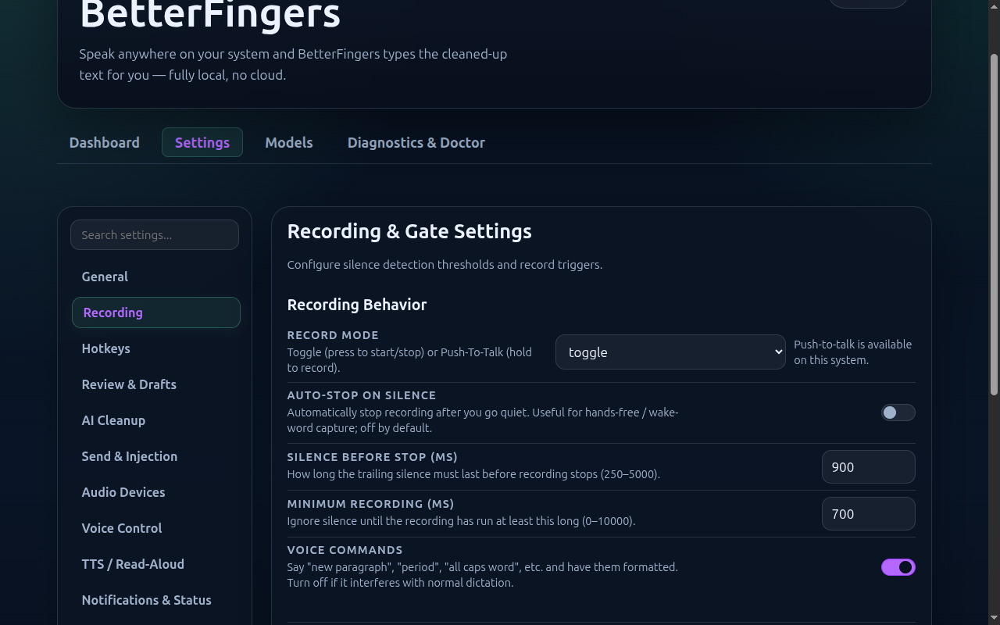

## voice-control

### disabled-default — ✅ PASS

Fresh install, wake word never enabled: the toggle is off, status reads "Disabled.", and the model picker shows "None imported" -- the honest default state since the catalog ships zero wake-phrase classifiers.

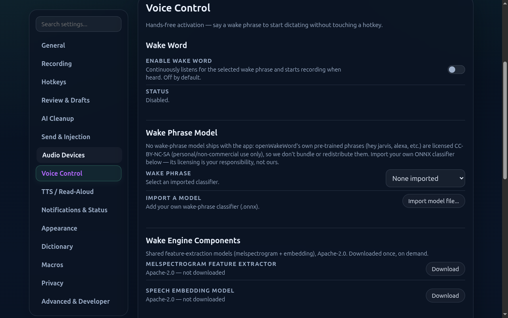

### backbone-not-downloaded — ✅ PASS

The Apache-2.0 melspectrogram/embedding backbone has not been downloaded yet: both entries show "not downloaded" with an enabled Download button each.

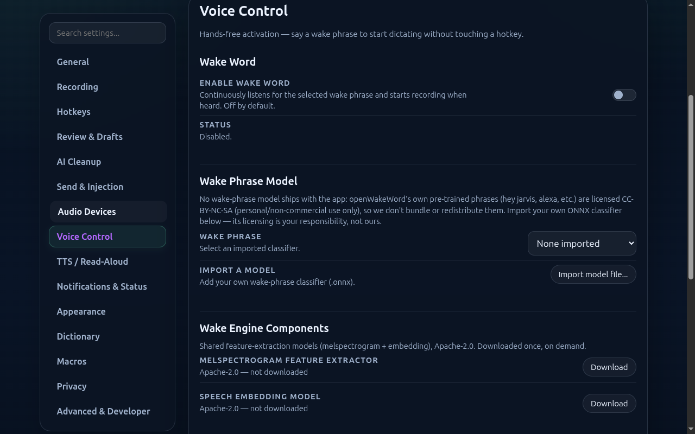

### backbone-downloading — ✅ PASS

User clicked Download on the melspectrogram backbone: the button immediately reflects "Downloading…" and disables itself while the background job runs (POST /wake/models/melspectrogram/download).

### backbone-downloading-stalls — ✅ PASS

Adversarial: the download-state poll reports `active: true` indefinitely (a stalled job). The button must stay in "Downloading…"/disabled rather than optimistically flipping to "Downloaded" -- proving the UI trusts the server's reported state, not the mere fact that a download was started.

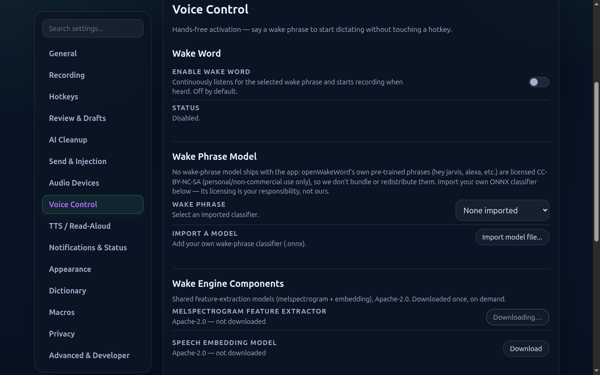

### backbone-ready-no-classifier — ✅ PASS

Backbone fully downloaded but no wake-phrase classifier selected: enabling reports the honest "unavailable: no wake-phrase classifier selected" reason rather than pretending to listen.

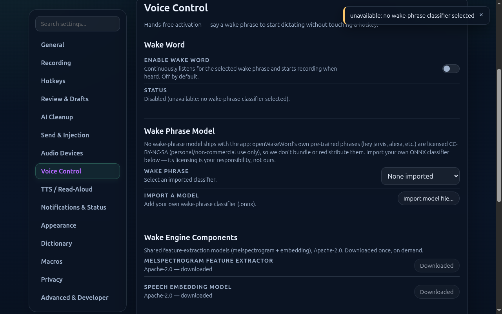

### user-imported-classifier-present — ✅ PASS

A user has imported their own wake-phrase classifier: it appears in the model picker labeled with its "user-provided" license, distinct from the (nonexistent) bundled options.

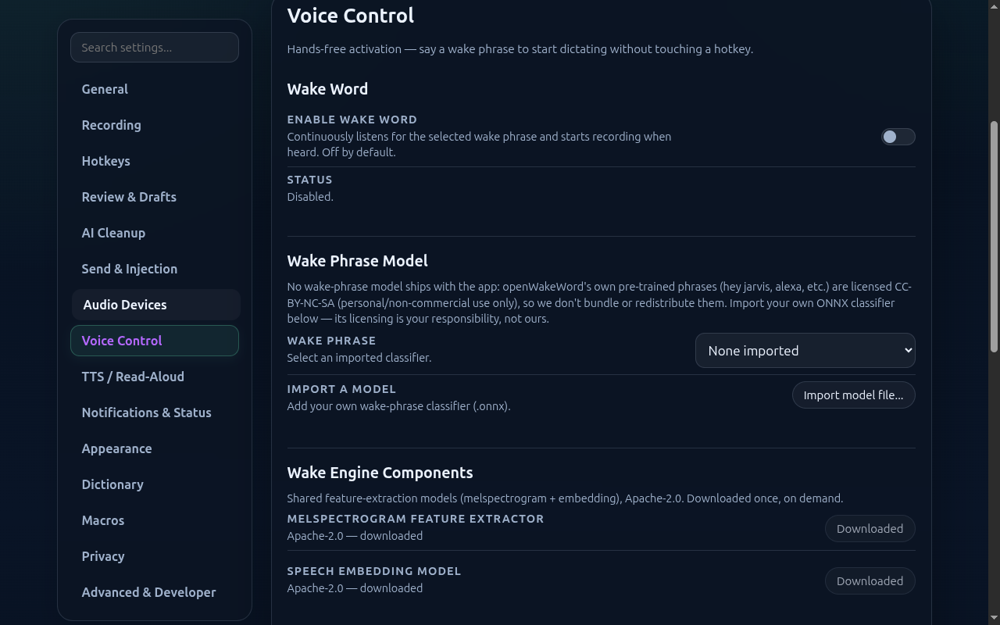

### import-rejected-server-side — ✅ PASS

Adversarial: the server rejects an import (e.g. oversized file, per wake_models.py's 20MB cap) with a 400. The UI must surface the rejection reason, not silently swallow it or claim success.

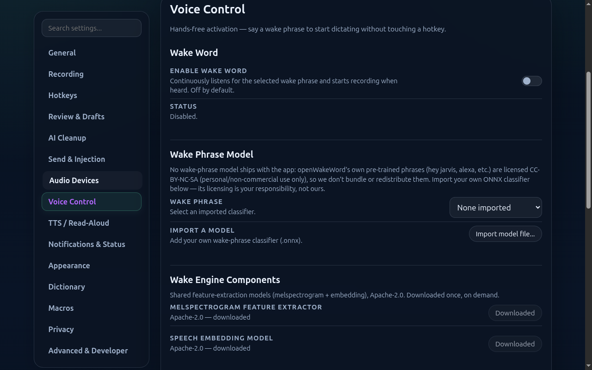

### listening-active — ✅ PASS

Wake word enabled and actively listening: the toggle is checked and the status line reports the live threshold/cooldown from the running service.

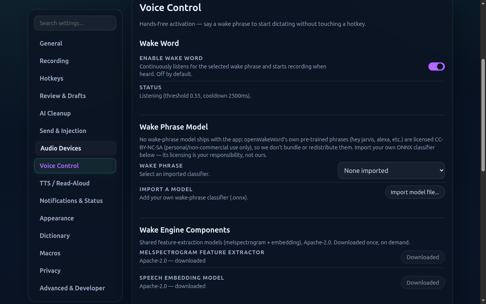

### live-test-score-bar — ✅ PASS

Running the live test (POST /wake/test) reports a peak score, which the tester renders as a filled bar plus a text summary of sample count.

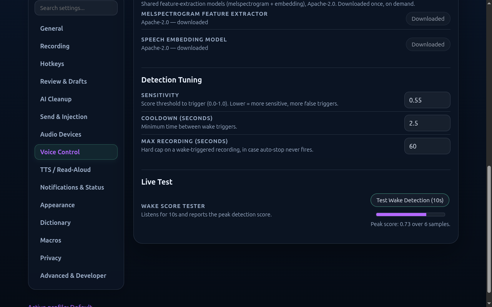

### LIE-listening-true-while-disabled `negative-control` — ✅ PASS

Negative control: the stub reports `listening: true` while `enabled: false` -- a truthfulness violation (the /wake/status contract says listening implies enabled). The expects() below assert the panel reflects this consistently and is EXPECTED TO FAIL against this deliberately-lying stub -- the runner inverts pass/fail for negative-control scenarios, so a green suite here means the harness caught the lie, not that it was fooled by it.

> Negative control result: OK: correctly caught the lie

## privacy

### wake-listener-inactive — ✅ PASS

Wake word disabled: the Privacy panel truthfully reports the listener as "Not active." rather than a generic/static claim -- it reflects the real backend state.

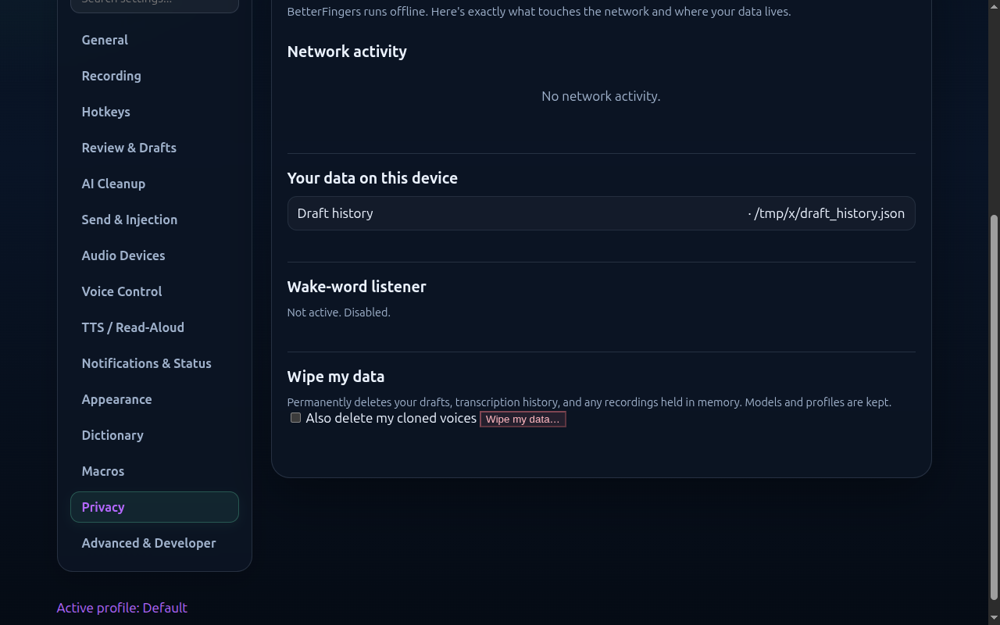

### wake-listener-active — ✅ PASS

Wake word enabled and listening: the Privacy panel reflects the listener as active and restates that audio is never persisted -- the same object the /wake/status truthfulness checks use, so this can never silently drift out of sync with the actual listening state.

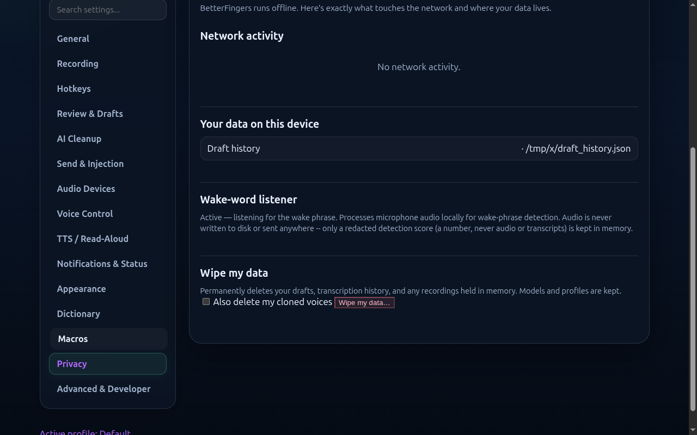

### LIE-wake-listener-active-but-wake-disabled `negative-control` — ✅ PASS

Negative control: /privacy claims the wake listener is active while /wake/status simultaneously reports disabled -- the two endpoints disagree, which a truthful UI reading only /privacy cannot detect on its own. This documents a real limitation (the Privacy panel does not cross-check /wake/status) rather than a bug: the assertion is written to demand cross-checking and is EXPECTED TO FAIL today, so a green result here means the harness is correctly catching that this cross-check does not exist yet.

> Negative control result: OK: correctly caught the lie

## model-resources

### resources-ledger-contract — ✅ PASS

GET /models/resources returns the resource ledger (per-component model_id/estimated_mb/pinned, available_mb, ram_floor_mb) -- verified reachable through the same main-process proxy bridge the app uses. NOTE: no Diagnostics UI currently renders this data (confirmed by grepping main.js for any consumer) -- this scenario locks in the API contract for whoever builds that UI, it is not a screenshot of a rendered state because none exists yet.

### llm-admission-refusal-contract — ✅ PASS

An LLM admission refusal surfaces as a structured payload at /doctor's llm.last_error (message string) + llm.last_error_details (resident components + suggested_model_id for a lighter fallback) -- confirmed via D5 handshake. STT/TTS refusals are plain strings with no structured route surface today (not stubbed here -- there is nothing to assert against). Same "no UI consumer yet" caveat as the ledger scenario applies.

### LIE-stt-refusal-fabricates-resident-list `negative-control` — ✅ PASS

Negative control (orchestrator-suggested): per the D5 handshake, STT/TTS admission refusals are ONLY ever a plain string -- there is no structured resident/suggested_model_id payload for them, that shape is LLM-only. This stub fabricates an STT refusal WITH an LLM-style structured resident list, which no real backend would ever produce. The assertion demands the asymmetry hold (structured details only ever accompanies the LLM component) and is EXPECTED TO FAIL against this stub -- a green result means the harness would catch a backend that started lying about which components get structured refusal detail.

> Negative control result: OK: correctly caught the lie

## doctor-warnings

### store-warnings-contract — ✅ PASS

GET /doctor carries a top-level store_warnings array covering quarantined-corrupt and downgrade_refused events across all four config stores (personas/voice-presets/profiles/app_state) -- one shared mechanism in store_migration.py, not per-store special cases. Verified as a direct sibling of health/stt/llm/etc, not nested under any of them.

### redacted-stderr-is-line-level-not-blob-level — ✅ PASS

llm.last_error_details.stderr is redacted PER-LINE, not as one blob-level marker: loader/diagnostic lines (matching the error/failed/missing/lib/.so/cuda/vulkan/version/build/load allowlist) survive verbatim (e.g. "libmtmd.so.0" stays readable for debugging), while any other line -- including anything that could carry user-adjacent content, like a logged prompt -- becomes an individual `<redacted N chars>` line. Asserts BOTH halves of that mix are present, not just "the field exists".
