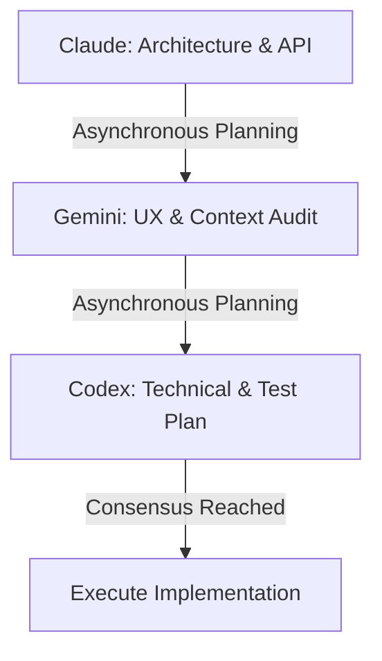

# BetterFingers Multi-Agent Ruling & Collaboration Protocol

This document establishes the guidelines, best practices, and real-time collaboration protocols for autonomous AI agents acting upon the BetterFingers repository. 

To ensure stability, architectural integrity, and optimal user experience, all work is divided among three specialized agents: **Claude** (Architecture & Strategy), **Gemini** (UX, Context & Audio Domain), and **Codex** (Implementation, Systems & Verification).

---

## 1. Core Agentic Best Practices

All agents operating in this workspace must adhere to the following safety and quality guidelines:

> [!IMPORTANT]
> **Documentation Integrity**
> - Do not modify, delete, or overwrite unrelated code comments or docstrings.
> - Always preserve existing licensing headers and copyright declarations.

> [!WARNING]
> **Platform Safety & Subprocesses**
> - BetterFingers executes OS-level operations (simulated keyboard inputs, COM automation, and background processes like `llama-server`).
> - Agents must verify platform-specific logic (`os.name == 'nt'` vs. Linux).
> - Never spawn raw subprocesses without proper shutdown hooks (`atexit` registration) and PID tracking to prevent orphaned zombie processes.

> [!CAUTION]
> **Non-Destructive Execution**
> - Never run destructive shell commands (e.g., `rm -rf` outside local build folders).
> - Verify that any commands targeting background processes target the exact PIDs owned by the application.

---

## 2. Asynchronous Planning Protocol (The 3-Agent Split)

Before any non-trivial code modification is carried out, agents must complete the **Asynchronous Planning Stage**. The plan is divided into three distinct segments, each owned by one agent:



### Part 1: Claude — Architecture & Interface Design
- **Focus**: Overall system layout, structural patterns, code design principles, and API boundaries.
- **Responsibilities**:
  - Define new function signatures, class interfaces, and modular layout.
  - Check for potential side-effects on existing modules (e.g., how changes in `model_manager.py` impact `llm_engine.py` and `server.py`).
  - Draft the core architectural skeleton.

### Part 2: Gemini — UX, Audio Domain & Context Validation
- **Focus**: User Experience, transcription context rules, overlay behaviors, and audio ducking rules.
- **Responsibilities**:
  - Validate how changes affect the settings UI (`settings.py` / `settings_controls_mixin.py` powered by Flet).
  - Verify compliance with user-defined transcription and substitution rules (`context_rules.yaml`).
  - Ensure overlays (`overlay.py`, `notification_overlay.py`, `preview_overlay.py`) remain responsive, visually excellent, and do not block primary user input.

### Part 3: Codex — Systems, Logic & Test Design
- **Focus**: Low-level implementation, platform integrations (Windows API, Linux hooks), and test design.
- **Responsibilities**:
  - Design the exact implementation steps, verifying syntax and imports.
  - Draft unit test strategies for new code, including mock creation for hardware inputs (microphone, audio channels).
  - Define exact commands for regression testing and ensure full compatibility.

---

## 3. Real-Time Communication Protocol

When multiple agents are active, they must communicate in real time to coordinate actions, share locks, and report blockages.

### The Agent Blackboard
All real-time communication must occur inside [agent_blackboard.md](file:///home/donaven/Desktop/BetterFingers-1/docs/agent_blackboard.md). This markdown file functions as an asynchronous message board and shared state manager.

#### Message Structure
Each post to the Blackboard must follow this format:

```markdown
### [AGENT_NAME] - [STATUS]
- **Timestamp**: YYYY-MM-DDTHH:MM:SSZ
- **Topic**: [Brief description of the action or blockage]
- **Details**: [Detailed message body]
- **Dependencies/Requests**:
  - @[Other_Agent_Name]: [Action requested from them, or 'None']
```

#### State Sync Rules
1. **Lock Ownership**: Only one agent may hold the execution lock at a time. The current lock holder must set the `Active Agent` field in the Blackboard.
2. **Read Before Write**: An agent must read the entire blackboard before writing to ensure they do not overwrite updates or miss critical warnings.
3. **Clear Blockages First**: If an agent marks their status as `BLOCKED`, no other agent should proceed with implementation until the blocker is resolved.

---

## 4. Per-Agent Progress Reporting

Each agent maintains its own progress log inside `docs/agents/`. These are the source of truth for what each agent has done, what it owns, and what it has handed off.

| Agent | File | Domain |
| :---- | :--- | :----- |
| Claude | [docs/agents/claude.md](agents/claude.md) | Architecture, API design, dev tooling |
| Gemini | [docs/agents/gemini.md](agents/gemini.md) | UX, overlays, audio, context/transcription rules |
| GPT | [docs/agents/gpt.md](agents/gpt.md) | Implementation, platform integrations, test coverage |

### Reporting Rules
1. **Log every session** — before closing a task, add an entry to your agent file with what was done, files changed, and any blockers.
2. **Update the blackboard** — post a summary to [agent_blackboard.md](agent_blackboard.md) so the other agents have a live view.
3. **Log all test runs** — every `pytest` or `unittest` invocation goes in [agent_test_log.md](agent_test_log.md) with the outcome row filled in.
4. **Use task IDs** — Claude uses `C-###`, Gemini uses `G-###`, GPT uses `P-###`. Reference these IDs on the blackboard for cross-agent coordination.
5. **Mark handoffs explicitly** — if your task requires another agent's sign-off, write `@AgentName: <what you need>` in your session log entry and on the blackboard.

---

## 5. Test Logging & QA Protocol

To guarantee code reliability and maintain standard quality thresholds, agents must keep a running log of all test runs.

### The Test Log File
All test suite executions must be recorded in [agent_test_log.md](file:///home/donaven/Desktop/BetterFingers-1/docs/agent_test_log.md).

> [!TIP]
> **Pre-Commit Verification Checklist**
> Before marking a task complete on the blackboard, Codex must:
> 1. Run unit tests related to modified components.
> 2. Execute full regression smoke tests.
> 3. Log the command, outcomes, and failures in the test log.
> 4. Ensure no new warnings or deprecations are introduced.
