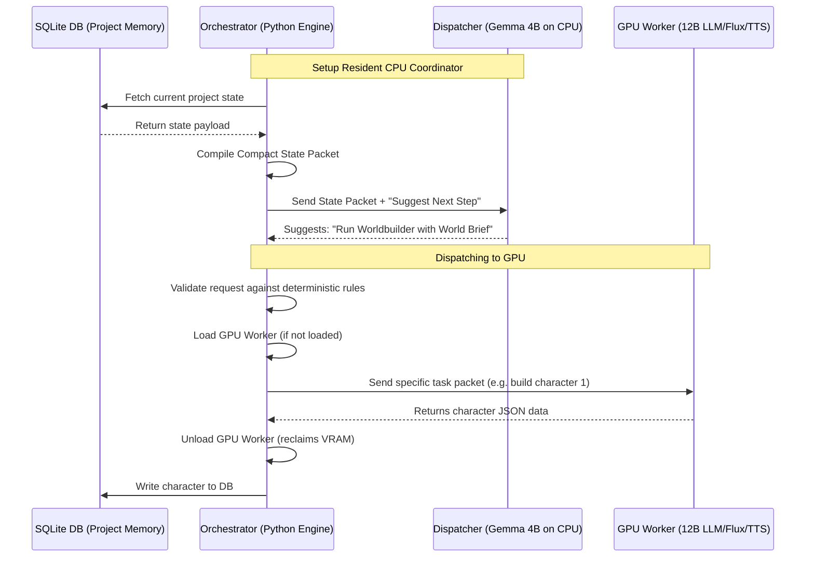

# Dispatcher Architecture Plan

This document details the design, integration points, and implementation roadmap for the **Dispatcher** (Status Narrator & CPU organizer worker) in BetterFingers Studio.

---

## 1. Executive Summary & Philosophy

The **Dispatcher** is an always-on, low-footprint coordinator model (Gemma 4B / E4B class) resident in system memory (CPU/RAM). It acts as the "Floor Manager" of the studio, running continuously without consuming precious GPU VRAM. 

Large, computationally heavy models (12B+ LLMs, SDXL/Flux image generators, Kokoro TTS, Stable Audio) are treated as **GPU transient workers**. They are loaded, executed, and unloaded dynamically under the supervision of deterministic code, ensuring the user's RTX GPU (e.g., RTX 4060 Ti 16GB) is never bottlenecked by keeping multiple giant models loaded in VRAM at the same time.

### The Core Rule of Statelessness
The Dispatcher **must not rely on chat context memory** to track progress. Doing so leads to context bloat and hallucination loops. Instead:
1. SQLite/Project Memory acts as the single source of truth.
2. Deterministic code compiles a compact, structured **State Packet** from the database.
3. The Dispatcher reads this packet and suggests the next action.
4. Deterministic code validates the suggestion before executing it.

---

## 2. Hardware Management: "Studio Mode Activation"

Running 12B+ text models, Flux image models, and audio generation concurrently will push the user's PC to its limits. To ensure transparency, we will introduce a **Studio Mode Gate**.

### The UX Warning Gate
Before entering Studio Mode, the UI will present a modal warning:
> **"Are you ready for Studio Mode? It's a lot."**
> *Entering Studio Mode will spawn local AI generation pipelines. Your GPU will be fully utilized, and your CPU will run background coordination. This will produce high-quality stories, but it will significantly slow down other tasks on your PC.*
> `[ Cancel ]` `[ Proceed to Studio Mode ]`

### The Resource Profile Selector
Inside the warning modal, the user can configure execution safety limits:
* **Background VRAM Saver (Default):** Unloads GPU workers immediately after they finish their task (freeing VRAM for OS/browser).
* **Speedy Pipeline (High RAM required):** Keeps GPU workers cached in VRAM if there is headroom.

---

## 3. Architecture & Data Flow

The following diagram outlines the communication between the SQLite memory, the Dispatcher (CPU), the Orchestrator, and the GPU Workers.



---

## 4. Integration Points in the Repository

The Dispatcher will hook directly into these existing subsystems:

### A. Model Manager (`model_manager.py`)
We will configure different target runners (CPU vs. GPU) for model allocation.
* **Dispatcher allocation:** Force `gemma-4-e4b-q4` or similar to load with `n_gpu_layers=0` (completely on CPU/RAM).
* **Transient loading hooks:** Implement `load_transient_gpu_model(model_id)` and `unload_gpu_model(model_id)` which call `llama-server` controls or terminate subprocesses to clear VRAM.

### B. Project State Compilation (`studio_memory.py`)
Create a method `compile_compact_state_packet(project_name, project_id)` that builds a minimal JSON summary of the project state:
```json
{
  "project_id": "...",
  "completed_stages": ["intake", "loremaster"],
  "current_stage": "world_building",
  "roster_names": ["Louis", "Father Time"],
  "last_activity": "Storyboard approved by user."
}
```

### C. Agent Orchestration (`studio_agents.py` & `studio_workflow.py`)
Modify `Producer` (the Headmaster) to consult the Dispatcher:
1. Instead of executing agents in a hardcoded list, the loop queries `Dispatcher.suggest_next_action(state_packet)`.
2. The orchestrator checks if the suggested agent has its prerequisites met on the blackboard.
3. The orchestrator spawns the GPU worker, executes the specialist agent, and returns the result to the blackboard.

---

## 5. Step-by-Step Implementation Roadmap

### Phase 1: The UI Warning & Studio Mode State
* Add a `Studio Mode` toggler in the Electron UI.
* Integrate the warning screen and store `studio_mode_active: bool` in local settings.
* Bind the performance settings profile to backend configurations.

### Phase 2: CPU vs GPU Model Isolation
* Extend `model_manager.py` to allow running multiple concurrent `llama-server` instances:
  * Instance 1 (Port 8080): Resident 4B model running on CPU threads.
  * Instance 2 (Port 8081): On-demand 12B model running with CUDA layers.
* Implement VRAM monitoring in `hardware_report.py` to assert VRAM is freed when transient models are unloaded.

### Phase 3: State Packet Compiler & Dispatcher Prompting
* Add the state parser to `studio_memory.py`.
* Write the Dispatcher's narrow system prompt:
  > *You are the Floor Manager. You receive a State Packet detailing a story's progress. Analyze the completed stages and recommend which agent should run next, or if the pipeline needs user feedback. Keep your responses short and structured.*
* Hook this coordinator model into `Producer.run()` in `studio_agents.py`.

### Phase 4: Bounded Job Packets & Guardrails
* Update specialist agents in `studio_workflow.py`. Instead of reading full, unstructured contexts, they receive narrow, schema-validated task briefs compiled by the Dispatcher (e.g. "Generate World Bible for the 'Dockside' region, using only 'Neon, Gritty, Rain' tone attributes").
